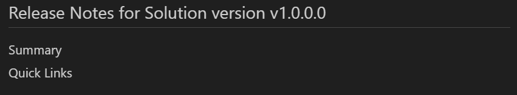

## Introduction

Creating release notes is a critical task to keep stakeholders informed about the changes, fixes, and improvements in a new software version. This task, however, can be tedious, time-consuming, and prone to error if done manually. Hence, we set out to build an automated release notes generation script leveraging PowerShell, Azure DevOps APIs, and the OpenAI's GPT-3.5-Turbo.

This blog post, the first in a multi-part series, will walk you through how we built the foundational parts of our script. It will cover the script setup, explaining each component and its role in generating detailed, pretty, yet succinct, release notes.

## Prerequisites

To follow along with this blog post, you will need the following:

- An Azure DevOps Account & Project [Sign Up for Azure DevOps](https://azure.microsoft.com/services/devops/)
- A Personal Access Token (PAT) to access Azure DevOps APIs [How to Create a DevOps PAT](https://learn.microsoft.com/en-us/azure/devops/organizations/accounts/use-personal-access-tokens-to-authenticate?view=azure-devops&tabs=Windows#create-a-pat)
- An OpenAI API Key [Sign Up for an API Key](https://platform.openai.com/account/api-keys)
- PowerShell 7 or later
- A PowerShell IDE (I use [Visual Studio Code](https://code.visualstudio.com/))
- A basic understanding of PowerShell
- A basic understanding of Azure DevOps
- A basic understanding of Markdown

## Getting Setup

The script I've developed is written in PowerShell and is designed to automate the generation of release notes. This process involves extracting and summarizing data from Azure DevOps, grouping them by work items, and creating a Markdown file with all this information.

### Script Flow

To understand the script, let's look at the key components in order.

The script is broken down into several parts:

1. Creating the output file and establishing a document structure
2. Retrieving work items using queries from Azure DevOps
3. Sending the work items to GPT to summarise the work done
4. Sending the entire output to GPT to summarise the release notes

The script is designed to be run as a scheduled task or as part of a DevOps pipeline. It can be run on-demand or on a schedule. The script will create a Markdown file with the release notes and a summary file with the summary of the release notes.

Before we get the script doing anything, we need to set up the variables and create the output file.

### Creating Your Queries in Azure DevOps

How you set up your queries in Azure DevOps is up to you, but for the purposes of this article, we will need three queries for work items:

1. Resolved (In this release)
2. In Testing (Possibly Coming Next Release)
3. Known Issues (Head off those support calls)

This is just based on the project requirements and client expectations when I wrote it, but you can modify the script to suit your needs. You can use one query or 100 queries, it's up to you.

Rather than me explaining an ever-evolving platform like Azure DevOps, I will point you to the [Microsoft Documentation](https://learn.microsoft.com/en-us/azure/devops/boards/queries/using-queries?view=azure-devops&tabs=browser) on how to create queries. You might set up your queries based on tags, commits, pull requests, sprints or however else your team differentiates between releases.

### Establishing Variables

Firstly, the script begins by setting up necessary variables such as organization name, project name, solution name, and various API keys.

```powershell
# Initialize variables
# Replace the values below with your own
# The organization name is the name of your Azure DevOps
# organization this should be the same as the URL you use to
# access Azure DevOps https://dev.azure.com/<yourOrganizationName>
$orgName = "<yourOrganizationName>"
# The project name is the name of your Azure DevOps project
# this should be the same as the URL you use to access Azure
# DevOps https://dev.azure.com/<yourOrganizationName>/<yourProjectName>
$projectName = "<yourProjectName>"
# What is your product/solution/software called?
$solutionName = "<yourSolutionName>"
# What is the version of this release?
$releaseVersion = "1.0.0.0"
# The query IDs below are the IDs of the queries we created in
# DevOps, these GUIDs are appended to the URL of the query in DevOps
# First the query that contains all the work items that were resolved
$releaseQuery = "00000000-0000-0000-0000-000000000000"
# Next the query that contains all the work items that are in still in testing
$inTestQuery = "00000000-0000-0000-0000-000000000000"
# Finally the query that contains all the work items that are known issues
$knownIssuesQuery = "00000000-0000-0000-0000-000000000000"
# We need a Personal Access Token (PAT) to access the Azure DevOps APIs
$pat = "<yourPAT>"
# We also need an OpenAI API Key to use the AI model
$openAIKey = "<yourOpenAIKey>"
```

We can of course turn these variables into parameters, but for the sake of simplicity, we will leave them as is for now, in later parts to the series we will explore how to make this script more dynamic and fit it into a DevOps pipeline.

Before we go any further and getting cool stuff to happen, we need to make sure that our variables are properly escaped. This is because we will be using these variables in URLs and we need to make sure that they are properly encoded to avoid any issues.

```powershell
# Encode $orgName and $projectName for URLs
$orgName = [System.Uri]::EscapeUriString($orgName)
$projectName = [System.Uri]::EscapeUriString($projectName)
# Encode $pat for Basic Authentication
$pat = [Convert]::ToBase64String([Text.Encoding]::ASCII.GetBytes(":$($pat)"))
# Set the headers for the API calls
$headers = @{Authorization = ("Basic {0}" -f $pat) }
```

## Creating the Output File

Now that we have our variables set up, we can create the output file. This is the file that will contain the release notes. We will also create a summary file that will contain the summary of the release notes.

```powershell
# Define the path to the output file, the below will output to
# the a New Releases folder in the directory where the script is run
$outputFile = ".\Releases\$solutionName-v$releaseVersion.md"
# Create the output file using the path defined above
New-Item -ItemType file -Path $outputFile -Force | Out-Null
# Create the Summary file
New-Item -ItemType file -Path '.\Releases\summary.txt' -Force | Out-Null
```

### Creating the Document Structure

Now that we have our output file, we can start writing stuff! We will start with the main header, version, and placeholders for the summary and table of contents.

```powershell
# Write the release notes header
"`n# Release Notes for $solutionName version v$releaseVersion`n`n## Summary`n`n<NOTESSUMMARY>`n`n## Quick Links`n`n<TABLEOFCONTENTS>" | Out-File -FilePath $outputFile -Encoding utf8 -Append
```

The "`n" is a line break, so we are writing the header, a line break, the summary header, a line break, and then a placeholder for the summary. We are then writing the table of contents header and a placeholder for the table of contents. Which gives us this:



**Note** our placeholders are hidden in the output

## Getting Our Work Items

Now that we have our output file, we can start getting our work items. We will start by getting the work items from our queries with the DevOps API.

```powershell
# Build the URI for the release query
$uri = "https://dev.azure.com/$orgName/$projectName/_apis/wit/wiql/$queryId`?api-version=6.0"
# Get the work items from the release query
$query = Invoke-RestMethod -Uri $uri -Headers $headers -Method Get
# Get the IDs of the work items from the query and join them into a comma separated string
$ids = $query.workItems.id -join ","

# Construct the URI to get the actual work items from the query with their expanded fields
$uri = "https://dev.azure.com/$orgName/$projectName/_apis/wit/workitems?ids=$ids&`$expand=all&api-version=6.0"
# Get the work items from the query
$workItems = Invoke-RestMethod -Uri $uri -Headers $headers -Method Get
# Write the number of work items found and the query URI to the console
Write-Output "Found $($workItems.count) work items. Query: $uri"
```

As a bonus you can output the work items to a json file so you can see what data is available like this:

```powershell
$workItems | ConvertTo-Json | Out-File -FilePath '.\workItems.json' -Encoding utf8
```

This is useful because DevOps may have been customised with additional fields and you may want to include them in your release notes.

## Sending Our Work Items to GPT

Stay tuned for Part 2!
